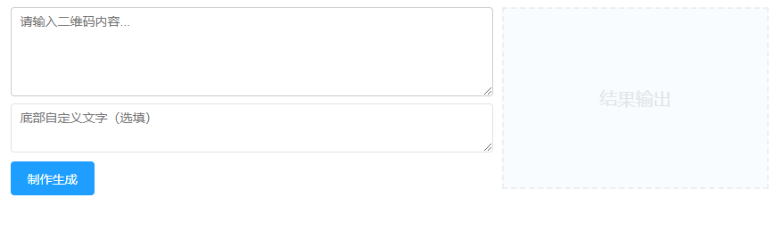
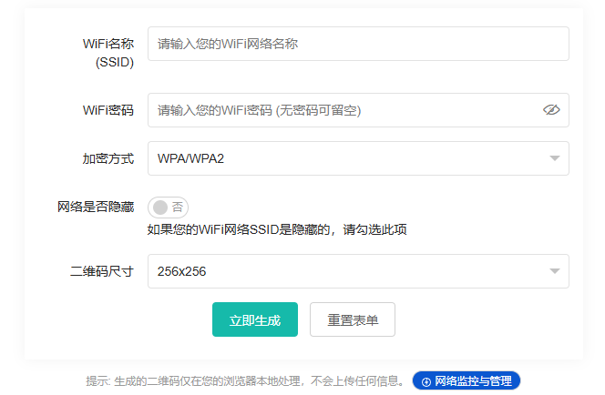
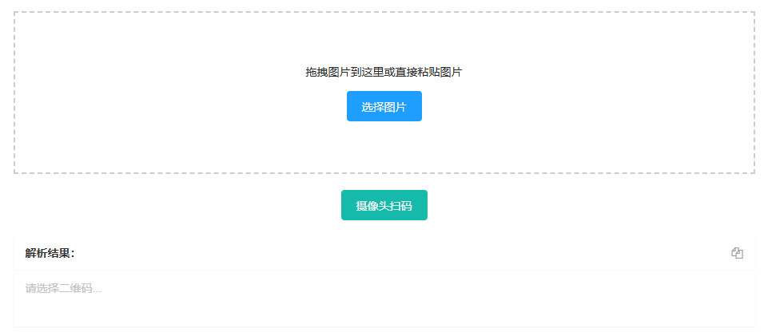
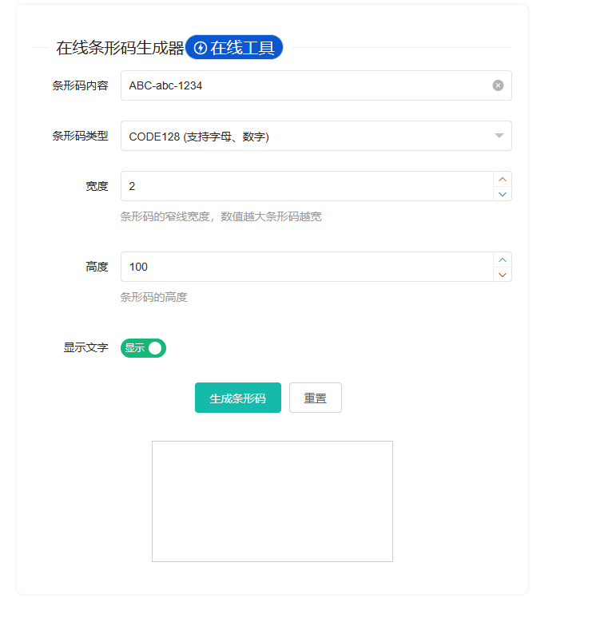

# 二维码工具集

- 包含多合一收款码生成、在线二维码制作、在线WiFi二维码生成、二维码在线解析、在线条形码生成功能

## 多合一收款码生成

### 功能概述
将微信和支付宝收款码合并为一个二维码，用户扫码后可根据使用的应用（微信/支付宝）自动跳转到对应的支付页面。

### 技术实现方案
采用**软件识别版方案**（业界主流，100%可靠）：
1. 生成一个指向跳转页面的URL二维码
2. 跳转页面根据User-Agent判断扫码应用类型
3. 自动重定向到对应的支付链接

#### 技术架构
```
用户扫码 → 跳转页面(pay-redirect.html) → 检测UA → 重定向到对应支付
```

#### 核心原理
- **微信识别**：检测UA中包含"MicroMessenger"
- **支付宝识别**：检测UA中包含"AlipayClient"
- **QQ识别**：检测UA中包含"QQ/"
- **浏览器**：显示选择页面

#### 功能特性
- ✅ 支持微信、支付宝、QQ三合一收款码
- ✅ 纯前端实现，无需后端服务
- ✅ 支持自定义跳转页面主题
- ✅ 支持缺省比例调整
- ✅ 生成的二维码可打印使用
- ✅ 数据隐私保护，不上传任何收款信息

### 使用流程
1. 上传微信收款码图片
2. 上传支付宝收款码图片
3. 选择主题样式
4. 调整缺省比例（可选）
5. 生成二合一收款码
6. 下载并打印使用

### 注意事项
- 生成的收款码包含跳转页面URL，需要确保跳转页面可访问
- 建议将`pay-redirect.html`部署到稳定的服务器或CDN
- 首次使用前建议用微信和支付宝分别测试



## 在线二维码制作

### 功能概述
提供通用的二维码生成功能，支持将文本、URL、联系方式等内容转换为标准二维码图片，并提供丰富的自定义选项。

### 功能特性
- ✅ **内容类型支持**：
  - 纯文本（Text）
  - 网址链接（URL）
  - 电子邮件（Email）
  - 电话号码（Phone）
  - 短信（SMS）
  - WiFi配置（WiFi）
  - vCard联系人（Contact）
  - 地理位置（Location）

- ✅ **样式自定义**：
  - 前景色/背景色选择
  - 二维码尺寸调整（200px - 2000px）
  - 容错级别选择（L/M/Q/H）
  - 边距大小调节

- ✅ **Logo添加**：
  - 支持上传自定义Logo图片
  - Logo大小比例调节（10%-30%）
  - Logo位置居中自动处理
  - 确保不影响扫码识别

- ✅ **格式导出**：
  - PNG格式下载
  - SVG矢量格式下载
  - 高分辨率打印优化

- ✅ **实时预览**：
  - 输入内容即时生成预览
  - 参数调整实时更新
  - 扫码测试提示

### 技术实现
```typescript
// 核心依赖
import { QRCodeSVG, QRCodeCanvas } from 'qrcode.react';

// 生成逻辑
const generateQR = () => {
  // 1. 验证内容格式
  const validatedContent = validateContent(content, type);

  // 2. 创建Canvas/SVG
  const qrElement = (
    <QRCodeCanvas
      value={validatedContent}
      size={size}
      level={errorCorrectionLevel} // L/M/Q/H
      bgColor={backgroundColor}
      fgColor={foregroundColor}
      includeMargin={includeMargin}
      imageSettings={logo ? {
        src: logo,
        x: undefined,
        y: undefined,
        height: logoSize,
        width: logoSize,
        excavate: true // 挖空Logo区域
      } : undefined}
    />
  );

  // 3. 导出为图片
  canvas.toDataURL('image/png');
};
```

### 使用流程
1. 选择内容类型（文本/URL/联系方式等）
2. 输入对应内容
3. 自定义样式（颜色、尺寸、容错级别）
4. （可选）上传Logo图片
5. 实时预览效果
6. 下载PNG或SVG格式

### UI设计参考


---

## 在线WiFi二维码生成

### 功能概述
快速将WiFi网络信息（SSID、密码、加密类型）转换为二维码，用户扫码后可一键连接WiFi，无需手动输入密码。

### 技术原理
WiFi二维码遵循特定格式规范：
```
WIFI:T:{加密类型};S:{SSID};P:{密码};H:{隐藏SSID};;
```

**加密类型**：
- `WPA` / `WPA2`：主流加密方式（推荐）
- `WEP`：旧式加密（安全性较低）
- `nopass`：无密码开放网络

**示例**：
```
WIFI:T:WPA;S:MyWiFi;P:password123;H:false;;
```

### 功能特性
- ✅ **多种加密支持**：WPA/WPA2、WEP、无密码
- ✅ **隐藏SSID支持**：可标记网络是否隐藏
- ✅ **尺寸自定义**：200px - 1000px可调
- ✅ **隐私保护**：纯前端处理，不上传任何WiFi信息
- ✅ **即时下载**：生成后立即保存为PNG图片
- ✅ **实时预览**：输入后即时显示二维码

### 技术实现
```typescript
// WiFi数据格式化
const formatWiFiData = (ssid: string, password: string, encryption: string, hidden: boolean) => {
  const escapeSpecial = (str: string) => str.replace(/([\\;,:])/g, '\\$1');

  return `WIFI:T:${encryption};S:${escapeSpecial(ssid)};P:${escapeSpecial(password)};H:${hidden};;`;
};

// 生成二维码
const wifiQRData = formatWiFiData(ssid, password, encryptionType, isHidden);
// 使用 qrcode.react 生成
<QRCodeCanvas value={wifiQRData} size={qrSize} />
```

### 使用流程
1. 输入WiFi名称（SSID）
2. 输入WiFi密码（如无密码则留空）
3. 选择加密类型（WPA/WPA2/WEP/无密码）
4. （可选）勾选"隐藏网络"
5. 选择二维码尺寸
6. 点击"立即生成"
7. 扫描测试或下载二维码

### 最佳实践
- **核对信息**：生成前仔细检查SSID和密码准确性
- **强密码建议**：建议使用复杂密码增强安全性
- **打印质量**：最小物理尺寸建议2.5cm x 2.5cm
- **测试扫描**：生成后先用自己设备测试
- **避免隐藏SSID**：隐藏SSID可能降低兼容性

### UI设计参考


---

## 二维码在线解析

### 功能概述
高效、快速、准确地解析图片中的二维码信息，支持多种输入方式（拖拽、粘贴、摄像头扫描），所有处理在浏览器本地完成，确保数据隐私。

### 主要功能
- ✅ **拖拽上传**：将包含二维码的图片拖拽至指定区域
- ✅ **粘贴识别**：直接粘贴剪贴板中的图片
- ✅ **文件选择**：点击选择本地图片文件
- ✅ **摄像头扫描**：启用设备摄像头实时扫描
- ✅ **结果复制**：一键复制解析结果
- ✅ **多格式支持**：支持PNG、JPG、JPEG、WebP等格式
- ✅ **隐私保护**：纯前端处理，不上传服务器

### 技术实现
```typescript
import jsQR from 'jsqr';

// 图片解码流程
const decodeQRCode = async (imageFile: File) => {
  // 1. 读取图片
  const img = new Image();
  const reader = new FileReader();

  reader.onload = (e) => {
    img.onload = () => {
      // 2. 绘制到Canvas
      const canvas = document.createElement('canvas');
      const ctx = canvas.getContext('2d');
      canvas.width = img.width;
      canvas.height = img.height;
      ctx.drawImage(img, 0, 0);

      // 3. 获取像素数据
      const imageData = ctx.getImageData(0, 0, canvas.width, canvas.height);

      // 4. 使用jsQR解码
      const code = jsQR(imageData.data, imageData.width, imageData.height, {
        inversionAttempts: 'dontInvert',
      });

      if (code) {
        console.log('解码成功:', code.data);
        console.log('位置信息:', code.location);
        return code.data;
      } else {
        throw new Error('未检测到二维码');
      }
    };
    img.src = e.target.result as string;
  };

  reader.readAsDataURL(imageFile);
};

// 摄像头扫描
const startCameraScan = async () => {
  const stream = await navigator.mediaDevices.getUserMedia({
    video: { facingMode: 'environment' }
  });

  const video = document.createElement('video');
  video.srcObject = stream;
  video.play();

  // 定时捕获帧并解码
  setInterval(() => {
    const canvas = document.createElement('canvas');
    const ctx = canvas.getContext('2d');
    canvas.width = video.videoWidth;
    canvas.height = video.videoHeight;
    ctx.drawImage(video, 0, 0);

    const imageData = ctx.getImageData(0, 0, canvas.width, canvas.height);
    const code = jsQR(imageData.data, imageData.width, imageData.height);

    if (code) {
      // 找到二维码，停止扫描
      stream.getTracks().forEach(track => track.stop());
      return code.data;
    }
  }, 100);
};
```

### 使用流程
1. 选择输入方式（拖拽/粘贴/文件选择/摄像头）
2. 上传图片或对准二维码
3. 自动识别并显示结果
4. 点击"复制"按钮复制内容
5. （可选）继续扫描其他二维码

### 应用场景
- 快速提取二维码中的文本信息
- 验证生成的二维码是否正确
- 批量解析多个二维码
- PC端扫码（通过摄像头）

### UI设计参考


---

## 在线条形码生成

### 功能概述
创建各种标准格式的条形码，支持多种编码类型，适用于产品管理、库存追踪、物流管理等场景。

### 支持的条码类型
| 类型 | 说明 | 适用场景 |
|------|------|----------|
| **CODE128** | 高密度，支持所有ASCII字符 | 物流、仓储、工业领域 |
| **EAN-13** | 13位数字，国际标准 | 零售商品结算 |
| **EAN-8** | 8位数字，短码 | 小包装商品 |
| **UPC-A** | 12位数字，北美标准 | 北美零售商品 |
| **CODE39** | 支持字母、数字、特殊字符 | 工业、军事、图书馆 |
| **ITF** | 交叉二五码，偶数位数字 | 物流包装箱 |
| **MSI** | 可变长度数字 | 库存管理 |
| **Codabar** | 支持数字和特殊字符 | 医疗、图书馆 |
| **Pharmacode** | 药品专用码 | 制药行业 |

### 功能特性
- ✅ **多格式支持**：9种主流条形码格式
- ✅ **高度自定义**：
  - 条码宽度调节（窄条宽度）
  - 条码高度调节
  - 显示/隐藏文本标签
  - 文本字体大小调整
- ✅ **即时预览**：所见即所得
- ✅ **一键下载**：PNG格式导出
- ✅ **内容验证**：自动校验格式合法性
- ✅ **免费无限制**：无限次生成和下载

### 技术实现
```typescript
import JsBarcode from 'jsbarcode';

// 生成条形码
const generateBarcode = (content: string, format: string, options: any) => {
  const canvas = document.createElement('canvas');

  try {
    JsBarcode(canvas, content, {
      format: format, // CODE128, EAN13, etc.
      width: options.width || 2,
      height: options.height || 100,
      displayValue: options.displayValue !== false,
      font: options.font || 'monospace',
      fontSize: options.fontSize || 18,
      margin: options.margin || 10,
      background: options.background || '#ffffff',
      lineColor: options.lineColor || '#000000',
    });

    // 导出为PNG
    const dataURL = canvas.toDataURL('image/png');
    return dataURL;
  } catch (error) {
    throw new Error(`条形码生成失败: ${error.message}`);
  }
};

// 内容验证
const validateContent = (content: string, format: string): boolean => {
  switch (format) {
    case 'EAN13':
      return /^\d{13}$/.test(content);
    case 'EAN8':
      return /^\d{8}$/.test(content);
    case 'UPC':
      return /^\d{12}$/.test(content);
    case 'ITF':
      return /^\d+$/.test(content) && content.length % 2 === 0;
    default:
      return content.length > 0;
  }
};
```

### 使用流程
1. 输入条形码内容
2. 选择条形码类型（CODE128/EAN13/CODE39等）
3. 调整参数：
   - 宽度（默认2px）
   - 高度（默认100px）
   - 是否显示文字
   - 字体大小
4. 点击"生成条形码"
5. 预览效果
6. 点击下载保存PNG图片

### 常见条码类型简介
- **CODE128**：最通用的条码格式，支持所有128个ASCII字符，密度高，应用广泛
- **EAN-13/UPC-A**：全球零售标准，用于商品结算和管理
- **CODE39**：早期工业标准，支持大写字母和数字，兼容性好
- **ITF**：专为数字设计，密度高，常用于外包装箱

### 注意事项
- 不同条码类型对内容有特定要求（如EAN13必须是13位数字）
- 打印时保持足够对比度（黑底白字或白底黑字）
- 最小打印尺寸建议：宽度≥2.5cm
- 测试扫描确保可读性

### UI设计参考


---

## 页面路由规划

### 路由结构
```
/tools
├── payment-merge-qr/          # 多合一收款码生成
│   └── page.tsx
├── online-qr-generator/       # 在线二维码制作（待创建）
│   └── page.tsx
├── wifi-qr-generator/         # WiFi二维码生成（待创建）
│   └── page.tsx
├── qr-decoder/                # 二维码在线解析（待创建）
│   └── page.tsx
└── barcode-generator/         # 在线条形码生成（待创建）
    └── page.tsx
```

### 导航入口
在主站点的工具导航卡片中添加：
1. **多合一收款码** - 微信支付宝合并收款码
2. **在线二维码制作** - 通用二维码生成器
3. **WiFi二维码** - WiFi连接二维码
4. **二维码解析** - 图片/摄像头识别二维码
5. **条形码生成** - 多种格式条形码

---

## 技术栈统一

### 核心依赖
```json
{
  "dependencies": {
    "qrcode.react": "^3.1.0",     // 二维码生成
    "jsqr": "^1.4.0",             // 二维码解码
    "jsbarcode": "^3.11.6"        // 条形码生成
  }
}
```

### 设计规范
- **UI组件**：使用shadcn/ui组件库
- **样式系统**：Tailwind CSS
- **图标**：Lucide React Icons
- **国际化**：自定义I18nProvider上下文
- **主题**：支持亮色/暗色模式
- **响应式**：移动端优先设计

### 开发原则
1. **纯前端实现**：所有处理在浏览器本地完成
2. **隐私保护**：不上传任何用户数据到服务器
3. **离线可用**：关键功能支持离线使用
4. **无障碍**：符合WCAG 2.1标准
5. **性能优化**：懒加载、代码分割、缓存策略

---

## 实施计划

### Phase 1: 基础功能（已完成）
- ✅ 多合一收款码生成页面
- ✅ 基础国际化配置

### Phase 2: 新增页面（待实施）
- [ ] 在线二维码制作页面
- [ ] WiFi二维码生成页面
- [ ] 二维码在线解析页面
- [ ] 在线条形码生成页面

### Phase 3: 优化完善（待实施）
- [ ] 完善所有页面的国际化
- [ ] 添加单元测试
- [ ] 性能优化
- [ ] 用户体验改进
- [ ] 文档完善

### Phase 4: 测试发布（待实施）
- [ ] 端到端测试
- [ ] 兼容性测试
- [ ] 部署上线
- [ ] 用户反馈收集