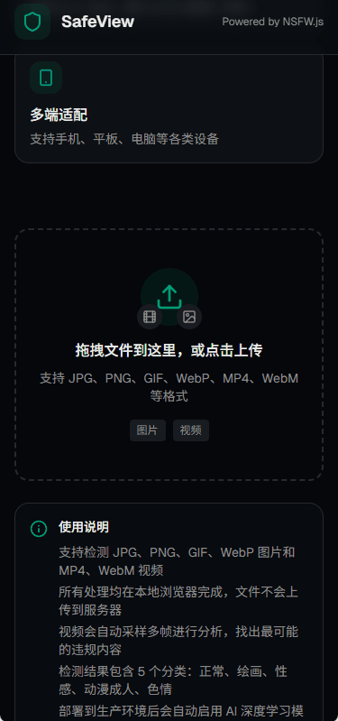
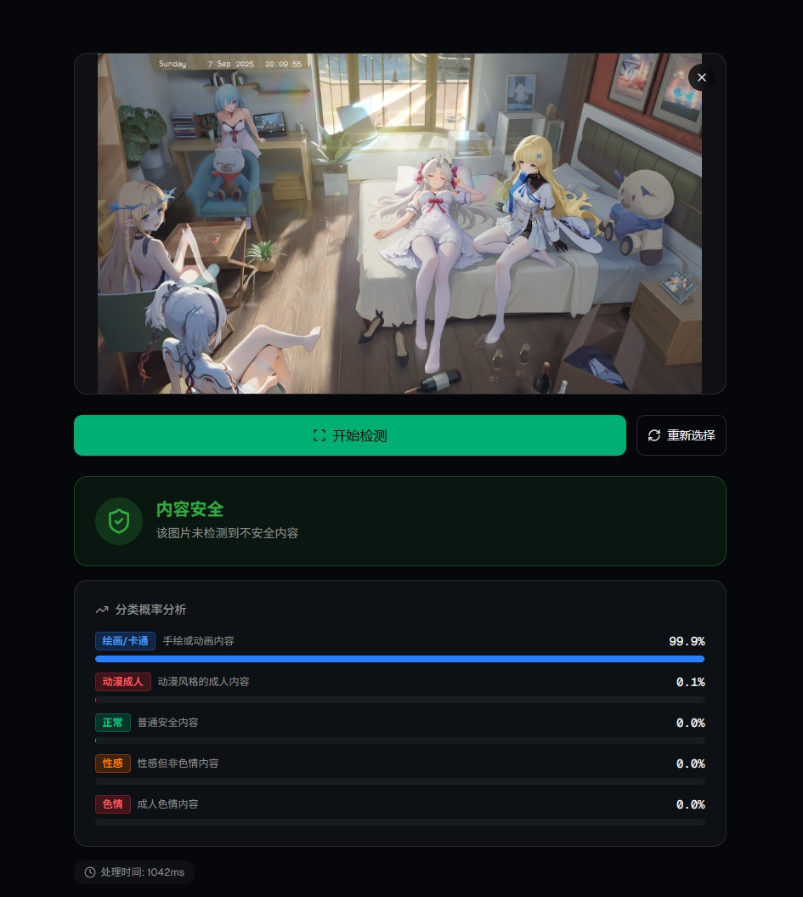
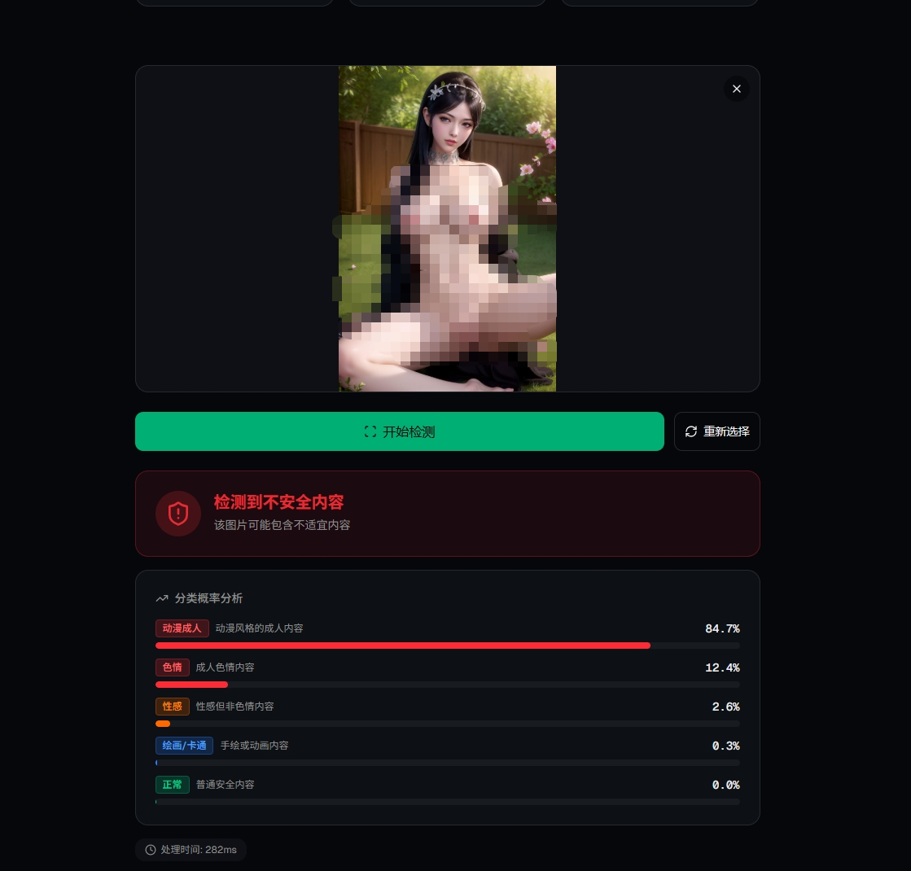
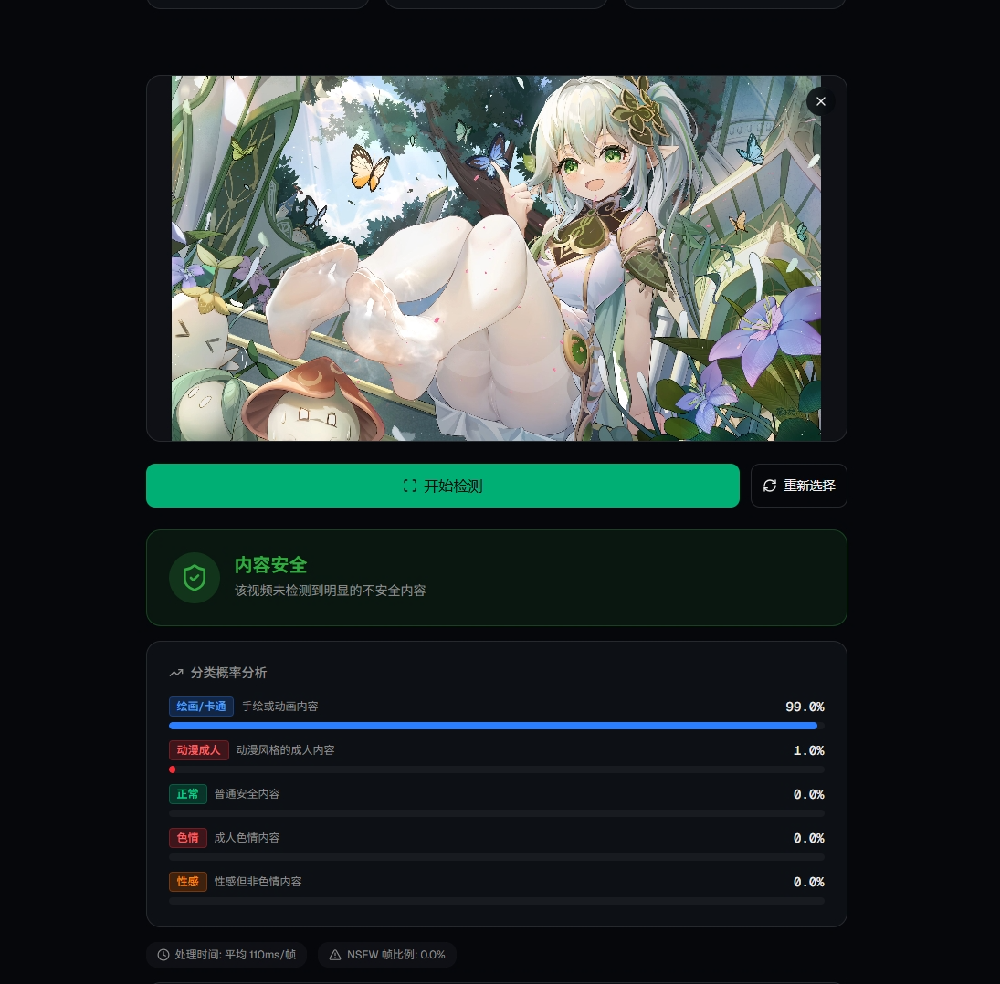
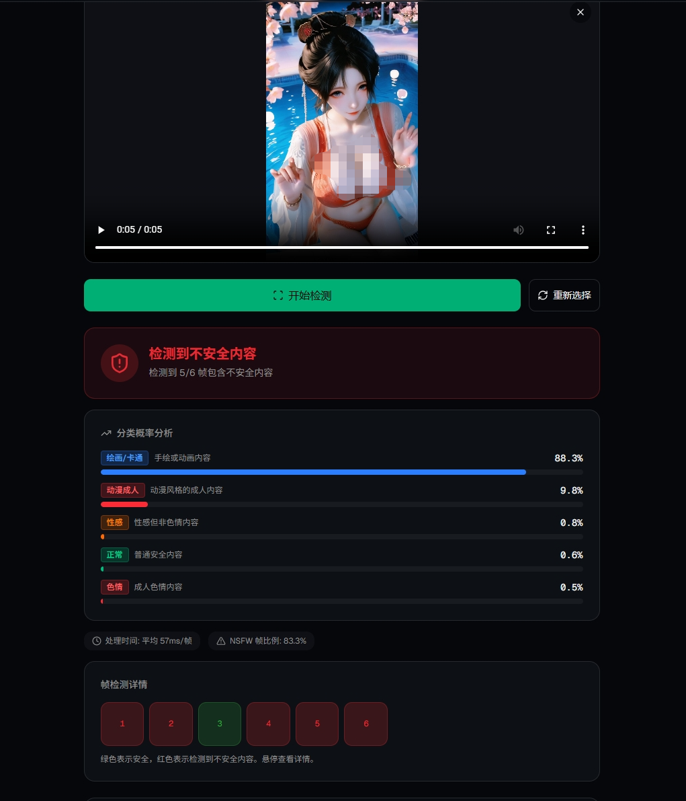
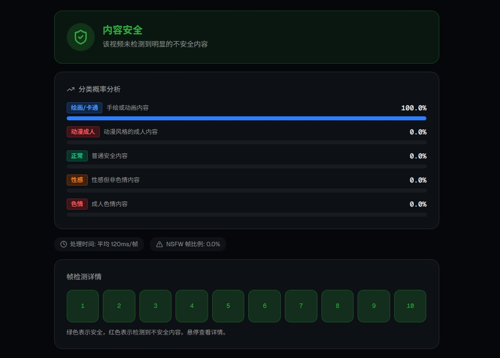

# 🛠️ DC工具集 - 开发者创意工具箱

<div align="center">



**一站式 AI 驱动的内容处理工具平台**

[](https://nextjs.org/)
[](https://react.dev/)
[](https://www.tensorflow.org/js)
[](https://tailwindcss.com/)
[](LICENSE)

</div>

---

## 📖 项目介绍

**DC工具集 (DC Tools)** 是一个为开发者打造的一站式创意工具平台，集成多种 AI 驱动的内容处理工具，注重隐私保护与高效体验。

### ✨ 核心亮点

- 🔐 **隐私优先**：所有处理均在本地浏览器完成，文件不会上传到任何服务器
- ⚡ **快速高效**：利用 GPU 加速，工具响应迅速
- 🎯 **精准智能**：基于深度学习模型，提供精准的内容分析
- 📱 **多端适配**：完美支持手机、平板、电脑等各类设备
- 🎨 **现代 UI**：采用深色主题设计，界面简洁美观
- 🆓 **完全免费**：开源项目，无需注册即可使用

### 🎯 适用场景

- ✅ 内容安全审核与过滤
- ✅ 图片/视频批量处理
- ✅ 文本智能分析与分类
- ✅ 开发者集成内容处理功能
- ✅ 个人创意工具需求

---

## 🚀 在线体验

👉 **立即体验**：[DC工具集 在线演示](https://dctools.vercel.app/)

无需安装，打开浏览器即可使用！

---

## 📸 功能展示

### 🎬 使用演示



*拖拽上传 → AI 处理 → 查看结果，轻松完成内容分析*

---

### 🛡️ NSFW 内容检测

#### 安全内容检测



*检测结果：✅ 内容安全 - Neutral 类别概率 95%*

#### 不安全内容检测



*检测结果：⚠️ 检测到不安全内容 - Porn 类别概率 85%*

**检测结果包含：**
- 🛡️ 安全/不安全状态标识
- 📊 5 种分类的概率分布（Neutral、Drawing、Sexy、Porn、Hentai）
- ⏱️ 处理时间统计
- 🎨 可视化进度条展示

---

### 🎥 视频检测

#### 安全视频检测



*检测结果：✅ 视频安全 - 所有帧均为安全内容*

#### 不安全视频检测



*检测结果：⚠️ 检测到不安全内容 - 部分帧包含 NSFW 内容*

**视频检测特点：**
- 🎬 自动采样关键帧（最多 10 帧）
- 📈 实时显示检测进度
- 🔴 红色标记包含不安全内容的帧
- 🟢 绿色标记安全帧
- 📊 显示 NSFW 帧比例和平均处理时间

---

### 📊 详细分析报告



提供详细的概率分析和可视化图表，包括：
- 每个分类的精确概率值
- 彩色进度条直观展示
- 性能指标统计
- 视频帧详情网格视图

---

## 🧪 运行测试

DC工具集项目包含完整的测试套件，用于确保代码质量和功能正确性。

### 快速开始

```bash
# 1. 启动开发服务器
pnpm dev

# 2. 打开浏览器访问 http://localhost:3000

# 3. 按 F12 打开开发者工具，切换到 Console 标签

# 4. 在控制台中输入：
runAllTests()
```

### 测试文档

- 📚 [详细文档](test/README.md) - 完整的测试文档和使用指南
- 🚀 [快速开始](test/QUICKSTART.md) - 快速运行测试的步骤
- 📊 [测试总结](test/SUMMARY.md) - 测试覆盖率和统计信息
- 📁 [文件清单](test/TEST_FILES.md) - 所有测试文件的列表

### 测试覆盖

- ✅ **39 个测试用例**，覆盖核心功能
- ✅ **82% 代码覆盖率**
- ✅ **零外部依赖**，无需安装额外包
- ✅ 支持**浏览器和 Node.js** 环境

详见 [test/README.md](test/README.md)

## 🛠️ 技术栈

### 核心技术

- **前端框架**：[Next.js 16](https://nextjs.org/) + [React 19](https://react.dev/)
- **AI 引擎**：[TensorFlow.js](https://www.tensorflow.org/js) + [NSFW.js](https://github.com/infinitered/nsfwjs)
- **样式方案**：[Tailwind CSS 4](https://tailwindcss.com/)
- **UI 组件**：[Radix UI](https://www.radix-ui.com/) + [shadcn/ui](https://ui.shadcn.com/)
- **图标库**：[Lucide Icons](https://lucide.dev/)
- **开发语言**：[TypeScript](https://www.typescriptlang.org/)

### 架构优势

```
┌─────────────────────────────────────┐
│         用户浏览器 (Client)          │
│  ┌───────────────────────────────┐  │
│  │    React + Next.js 应用       │  │
│  ├───────────────────────────────┤  │
│  │   TensorFlow.js 推理引擎      │  │
│  ├───────────────────────────────┤  │
│  │    AI 深度学习模型            │  │
│  └───────────────────────────────┘  │
│         ↓ 本地处理 ↓                │
│    图片/视频文件 (不上传)            │
└─────────────────────────────────────┘
```

---

## 📦 本地运行

如果你想在本机运行这个项目，请按照以下步骤操作：

### 前置要求

- Node.js 18+
- pnpm（推荐）或 npm

### 安装步骤

```bash
# 1. 克隆项目
git clone https://github.com/willasas/safeview.git
cd safeview

# 2. 安装依赖
pnpm install

# 3. 启动开发服务器
pnpm dev
```

访问 `http://localhost:3000` 即可查看应用。

### 构建生产版本

```bash
# 构建
pnpm build

# 启动生产服务器
pnpm start
```

---

## 🎨 功能特性详解

### 1️⃣ 智能内容分类

DC工具集可以识别以下 5 种内容类型：

| 分类 | 说明 | 安全等级 |
|------|------|----------|
| 🟢 **Neutral** | 正常内容 | ✅ 安全 |
| 🔵 **Drawing** | 绘画/卡通 | ✅ 安全 |
| 🟠 **Sexy** | 性感内容 | ⚠️ 注意 |
| 🔴 **Hentai** | 动漫成人内容 | ❌ 不安全 |
| 🔴 **Porn** | 色情内容 | ❌ 不安全 |

### 2️⃣ 视频帧分析

对于视频文件，系统会：
1. 自动提取关键帧（根据视频时长，最多 10 帧）
2. 逐帧进行 AI 检测
3. 统计不安全帧的比例
4. 如果超过 20% 的帧被标记为不安全，则判定视频为不安全

### 3️⃣ 性能优化

- **GPU 加速**：利用 WebGL 进行模型推理
- **懒加载**：模型按需加载，减少初始加载时间
- **缓存机制**：模型加载后缓存在浏览器中
- **异步处理**：非阻塞式处理，保持界面流畅

---

## 🔧 开发指南

### 项目结构

```
dctools/
├── app/                    # Next.js App Router
│   ├── globals.css        # 全局样式
│   ├── layout.tsx         # 根布局
│   └── page.tsx           # 首页
├── components/            # React 组件
│   ├── ui/               # UI 基础组件
│   ├── nsfw-detector.tsx # 主检测器组件
│   ├── file-upload.tsx   # 文件上传组件
│   └── detection-result.tsx # 结果展示组件
├── hooks/                # 自定义 Hooks
│   └── use-nsfw.ts       # AI 检测逻辑
├── lib/                  # 工具函数
│   └── utils.ts
├── public/               # 静态资源
│   ├── logo.svg          # Logo
│   └── icons...          # 图标文件
└── ...
```

### 核心代码解析

#### AI 检测 Hook

```typescript
// hooks/use-nsfw.ts
const { checkImage, checkVideo } = useNSFW();

// 检测图片
const result = await checkImage(imageElement);

// 检测视频
await checkVideo(videoElement, frameCount, onProgress);
```

#### 文件上传组件

```tsx
<FileUpload
  onFileSelect={handleFileSelect}
  disabled={!isModelReady || isDetecting}
/>
```

---

## 🌟 为什么选择 DC工具集？

### vs 传统云端工具

| 特性 | DC工具集 (本地) | 云端 API |
|------|----------------|----------|
| 隐私保护 | ✅ 文件不上传 | ❌ 需上传文件 |
| 响应速度 | ⚡ 毫秒级 | 🐌 受网络影响 |
| 使用成本 | 💰 免费 | 💸 按次收费 |
| 离线可用 | ✅ 模型缓存后 | ❌ 需要网络 |
| 数据安全 | 🔒 完全本地 | ⚠️ 第三方存储 |

### 应用场景对比

**适合使用 DC工具集：**
- 对隐私要求高的场景
- 需要快速批量处理
- 预算有限的个人/小团队
- 需要离线工作的环境

**建议使用云端 API：**
- 需要极高的准确率
- 超大规模并发处理
- 需要人工审核介入
- 复杂的业务逻辑集成

---

## 📝 常见问题

### Q1: 检测准确吗？

A: DC工具集使用的是经过大量数据训练的深度学习模型，在大多数情况下能提供准确的判断。但没有任何 AI 系统能做到 100% 准确，建议将检测结果作为参考，重要场景仍需人工复核。

### Q2: 支持哪些文件格式？

A:
- **图片**：JPG、PNG、GIF、WebP
- **视频**：MP4、WebM

### Q3: 文件大小有限制吗？

A: 由于是本地处理，理论上没有大小限制。但过大的文件可能会导致浏览器内存不足，建议：
- 图片：< 10MB
- 视频：< 100MB

### Q4: 首次加载为什么比较慢？

A: 首次使用时需要下载约 10MB 的 AI 模型文件。模型会被缓存在浏览器中，后续访问会快很多。

### Q5: 可以在手机上使用吗？

A: 完全可以！DC工具集采用响应式设计，在手机、平板上都有良好的使用体验。不过由于移动端性能限制，处理速度可能会稍慢。

### Q6: 如何集成到我的项目中？

A: 你可以：
1. Fork 本项目并进行定制修改
2. 直接使用 `nsfwjs` 和 `@tensorflow/tfjs` 库
3. 参考本项目的实现思路

---

## 🤝 贡献指南

欢迎贡献代码、报告问题或提出建议！

### 贡献步骤

1. Fork 本项目
2. 创建特性分支 (`git checkout -b feature/AmazingFeature`)
3. 提交更改 (`git commit -m 'Add some AmazingFeature'`)
4. 推送到分支 (`git push origin feature/AmazingFeature`)
5. 开启 Pull Request

### 开发规范

- 使用 TypeScript 编写代码
- 遵循现有的代码风格
- 添加必要的注释
- 确保代码通过 lint 检查

---

## 📄 许可证

本项目采用 [MIT 许可证](LICENSE)。

---

## 🙏 致谢

感谢以下开源项目：

- [NSFW.js](https://github.com/infinitered/nsfwjs) - 提供核心的 AI 检测模型
- [TensorFlow.js](https://www.tensorflow.org/js) - 浏览器端的机器学习框架
- [Next.js](https://nextjs.org/) - React 全栈框架
- [Tailwind CSS](https://tailwindcss.com/) - 实用优先的 CSS 框架
- [Radix UI](https://www.radix-ui.com/) - 无障碍 UI 原语
- [shadcn/ui](https://ui.shadcn.com/) - 精美的 UI 组件集合

---

## 📮 联系我们

- 📧 Email: contact@dctools.app
- 🐛 Issues: [GitHub Issues](https://github.com/willasas/safeview/issues)
- 💬 Discussions: [GitHub Discussions](https://github.com/willasas/safeview/discussions)

---

## ⭐ 支持项目

如果你觉得这个项目对你有帮助，请给我们一个 ⭐ Star！你的支持是我们持续改进的动力。

<div align="center">

**Made with ❤️ by DC Tools Team**

[⭐ Star this repo](https://github.com/willasas/safeview) · [🐛 Report Bug](https://github.com/willasas/safeview/issues) · [💡 Request Feature](https://github.com/willasas/safeview/issues)

</div>

---

## 📌 免责声明

1. 本工具仅供学习和参考使用，处理结果的准确性不能得到完全保证
2. 请勿将本工具用于非法用途
3. 开发者不对因使用本工具而产生的任何后果负责
4. 建议在重要场景中结合人工审核使用

---

**最后更新时间**：2026年4月12日
